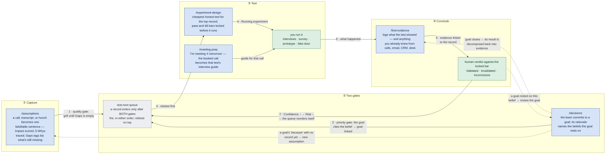
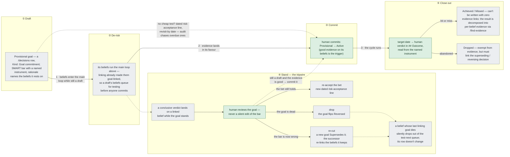

# Validation-OS

[](https://github.com/bfish1996/validation-os/actions/workflows/ci.yml)

**An operating system for de-risking your startup — one falsifiable
assumption at a time.** Six agent skills that turn the beliefs your
business depends on into a scored, evidence-ranked register, and every
meeting, transcript, and research hour into Confidence against it.

Built and battle-tested daily running a real startup's assumption
register; extracted here so any team can run it, in any agent harness,
against any backend.

## Why this exists

Most startups don't die from building badly — they die from building the
wrong thing *confidently*. The beliefs the plan rests on ("SMBs will pay
for this", "the bank will integrate", "regulation permits it") stay in
founders' heads, untested, while the roadmap compounds on top of them.

Validation-OS makes those beliefs impossible to ignore:

- Every belief becomes an **Assumption** — one falsifiable sentence, scored
  for Impact, traced to its roots with a disciplined 5 Whys.
- Every assumption gets **Risk = Impact × (1 − Confidence/100)** — and
  Confidence is *never typed by hand*: it's the strength of the strongest
  concluded **Experiment**, on an 8-rung evidence ladder from Opinion (5%)
  to Paying users (99%).
- The register **reorders itself**: evidence lands → Confidence rises →
  Risk falls → the next-riskiest belief surfaces. You always know what to
  test next.
- A shared **glossary** keeps the team speaking one language, and a
  **decision log** records what was decided and how unanimously — without
  letting a business call masquerade as validation.
- **Goals/OKRs plug in as decisions**: committing to a goal is
  evidence-gated against the beliefs it rests on, committed goals focus the
  test-next queue, and every hit or miss decomposes back into evidence —
  while your CRM/analytics stay the scoreboard
  ([docs/goals.md](docs/goals.md)).

The loop:

```
Assumption → grill & score → Experiment (pre-registered pass/kill bars)
     → Evidence → Confidence ↑ → Risk ↓ → next-riskiest assumption
```

Theory, ladder, cadence, and goals: [docs/method.md](docs/method.md) ·
[docs/evidence-ladder.md](docs/evidence-ladder.md) ·
[docs/validated.md](docs/validated.md) ·
[docs/weekly-ritual.md](docs/weekly-ritual.md) ·
[docs/goals.md](docs/goals.md). Not just product — sales outreach,
pricing, fundraising, partnerships: [docs/domains.md](docs/domains.md).

## Quickstart

```bash
npx skills add bfish1996/validation-os
```

Pick the skills and the agents you use (Claude Code, Codex, Cursor,
opencode — [70+ harnesses](https://skills.sh)). Then, in your workspace:

```
/setup-validation-os
```

Setup asks where your registry should live and writes a
`validation-os.config.yaml`. **Zero-dependency default:** plain markdown
files in a `registry/` directory — git-tracked, no API keys, working in
under a minute. Already run your product work in Notion? Choose the Notion
connector and point the config at your own databases
([connectors/notion.md](connectors/notion.md)).

Update later with `npx skills update`. Versioned releases are tagged
(`vX.Y.Z`) with notes in [CHANGELOG.md](CHANGELOG.md).

## The skills

| Skill | What it does | Invoke it when |
|---|---|---|
| `/assumptions` | Build, grill, audit the Assumption Registry. Five modes: single (default, gated), seed, audit, loop (autonomous, explicit opt-in), triage. | "grill this assumption", "map assumptions from this call", "audit the register" |
| `/experiment-design` | Turn the riskiest assumption into a falsifiable, pre-registered test; prep the instrument (interview guide, survey, prototype brief, fake-door spec). | "how do I test this", "design an experiment", "interview guide for X" |
| `/find-evidence` | Sweep what you *already* know — internal record (calls, chat, email, CRM) and rigorous desk research — and log it as conclusive evidence. | "what do we already know about X", "desk research this" |
| `/meeting-prep` | Person-first: research whoever you're meeting, then work backward to the high-Risk assumptions they're uniquely qualified to test. | "I'm speaking to X tomorrow", "what should I ask X" |
| `/decisions` | The shared glossary + the decision log — capture, sweep, audit; retire assumptions by explicit decision, never by accident. Goal commitments live here: evidence-gated in, closed out into evidence. | "log this decision", "commit to this goal", "close out the goal", "what's the canonical term for X" |
| `/self-review` | A private coach: sweep your own recorded calls for pitches and load-bearing claims, score yourself against the registers (decision fidelity, assumption transparency, experiment-first, concreteness), track trends, get improve-next actions. Writes only to a local gitignored directory — never through the connector. | "review my calls", "how did I pitch", "am I still reopening settled decisions" |

All six read the same config and enforce the same shared rulesets
(`skills/_shared/`); the first five write through the same connector, while
`/self-review` reads the registers but writes only to its private local
directory. Writes are **gated**
by default — every mutation is shown and confirmed before it lands; the
autonomous bulk modes are opt-in by explicit phrasing and leave an
auditable run-log plus a `Human review` gap a human must clear.

### How skills are invoked

Type the slash command (`/assumptions`) in any harness that supports
skills, or just describe the task — each skill's description carries its
trigger phrases, so "I'm meeting the CFO of X tomorrow" reaches
`/meeting-prep` on its own. Skills hand off to each other at their scope
boundaries: `/assumptions` stops where `/experiment-design` starts, and
both stop before *running* anything — verdicts stay human.

**Worked examples:** [examples/](examples/) follows one real assumption —
validation-os run on itself, on its own launch day — from first mention to
logged decision — one short scene per skill. The register it produces is
real too: [registry/](registry/).

## How it fits together

One assumption travels left to right through four stages. Follow the
numbered arrows 1→7 — that's the whole journey. Dashed arrows are the
feedback loops that make it a system rather than a pipeline. Colour says
who acts: **blue** = a skill, **green** = a human moment, **grey** = the
register itself.



After step 7 the loop closes: the next-riskiest belief is already sitting
on top of the queue. [examples/](examples/) walks this exact journey with
one concrete assumption, one scene per skill.

The goal in gate ② has a lifecycle of its own — drafting it is what opens
the gate, and its verdict at the end flows back in as evidence. Same
colours:



A hit becomes top-rung evidence on the beliefs it proved; a miss usually
invalidates one specific belief — either way the loop's next lap starts
better informed.

Underneath the flow, an assumption's `Status` stores only its lifecycle —
three values, because **an assumption is never validated**
([docs/validated.md](docs/validated.md)): its standing is its live `Risk`
score, moving forever as evidence and stakes move.

```mermaid
stateDiagram-v2
  direction LR
  D: Draft — Gaps non-empty; being built, not yet ranked
  L: Live — ranked by Risk, forever; never "done"
  I: Invalidated — conclusively killed; the rare, real closure

  [*] --> D
  D --> L: /assumptions — grill close-out, Gaps empty
  L --> D: a new gap lands — audit finding, contradiction, staleness
  L --> I: human verdict — conclusive kill at a rung ≥ the strongest support
  I --> L: gated reopen — kill re-judged flawed, or the world changed
```

Everything a kanban would store is a **derived view**, computed from the
row's data:

| Derived view (never stored) | Computed from |
|---|---|
| Goal-linked | a standing goal commitment cites it via `Based on assumption` |
| Testing | a linked experiment is `Running` |
| Test-next queue | Live + goal-linked + no running experiment + Risk above the working threshold |
| Proven set | Live + strongest concluded experiment `Validated` — provisional, always |
| Moot | Impact dropped to 0 by a resolving decision; reversal restores it |

Three things never move `Status`: logging evidence (that moves
`Confidence`, which moves `Risk`, which moves the queue), decisions (a
resolving decision moves `Impact` to 0 — mootness, not closure), and the
autonomous bulk modes (`/assumptions` loop, `/decisions` sweep) — those tag
`Human review`, which holds the row in `Draft`, and only a gated session
with the record's owner promotes their work.

## Configuration

One file, `validation-os.config.yaml`, at your workspace root (template:
[templates/validation-os.config.yaml](templates/validation-os.config.yaml)):

```yaml
connector: local-files        # or: notion | sql | nosql
local_files:
  registry_dir: registry
vocabulary:
  lens: [Commercial, Consumer, Investor]   # your audiences
  area: [Product, Go-to-market, ...]       # your domains
  audiences: [End user, Investor, Partner, Internal]
evidence_sources: [web]       # + fireflies, slack, gmail, attio — whatever
                              #   your harness actually has connected
```

No config at all still works: local files, web-only evidence. Skills
degrade gracefully — with no call-transcript or CRM sources connected,
`/find-evidence` and `/meeting-prep` fall back to desk research and
paste-your-notes.

**Storage backends** are pluggable connectors:
[local-files](connectors/local-files.md) (default) ·
[notion](connectors/notion.md) · [sql](connectors/sql.md) ·
[nosql](connectors/nosql.md) · [write your own](docs/writing-connectors.md)
against [the spec](connectors/SPEC.md). Each ships with a schema guide
(`connectors/<name>-schema.md`) that `/setup-validation-os` uses to validate
or build the backend for you — validate-first, every change gated.

## Dashboard

A zero-dependency local viewer for the registers — stat tiles and
sortable, expandable tables, riskiest belief on top:

```bash
python3 dashboard/serve.py    # http://localhost:8787
```

Markdown stays the source of truth: the page re-parses `registry/` on
every refresh, and the same parse is served at `/registry.json` (and
downloadable from the page) for anything that wants the registers as
JSON. Works on any project using the local-files connector — it reads
`registry_dir` from your config.

## Repo map

```
skills/               the six skills + setup, one dir per skill
  _shared/            the rulesets every skill cites (guardrails, schema +
                      machine-readable ontology, evidence procedures, gate
                      discipline)
connectors/           storage contract + reference implementations
registry/             the live self-hosted register — validation-os run on
                      itself (examples/ narrates it; this is the record)
examples/             one assumption followed end-to-end, a scene per skill
dashboard/            local read-only viewer + JSON view of the registers
templates/            config + starter registry files
docs/                 the method, the evidence ladder, the weekly ritual,
                      where it applies by function
```

## Credits & lineage

The method stands on public shoulders: Itamar Gilad's **Confidence Meter**,
Strategyzer's ***Testing Business Ideas***, Rob Fitzpatrick's ***The Mom
Test***, and Eric Evans' **ubiquitous language** (DDD). Repo conventions
follow the [Agent Skills](https://skills.sh) ecosystem; structural
inspiration from [mattpocock/skills](https://github.com/mattpocock/skills)
and [garrytan/gstack](https://github.com/garrytan/gstack).

MIT — see [LICENSE](LICENSE).
